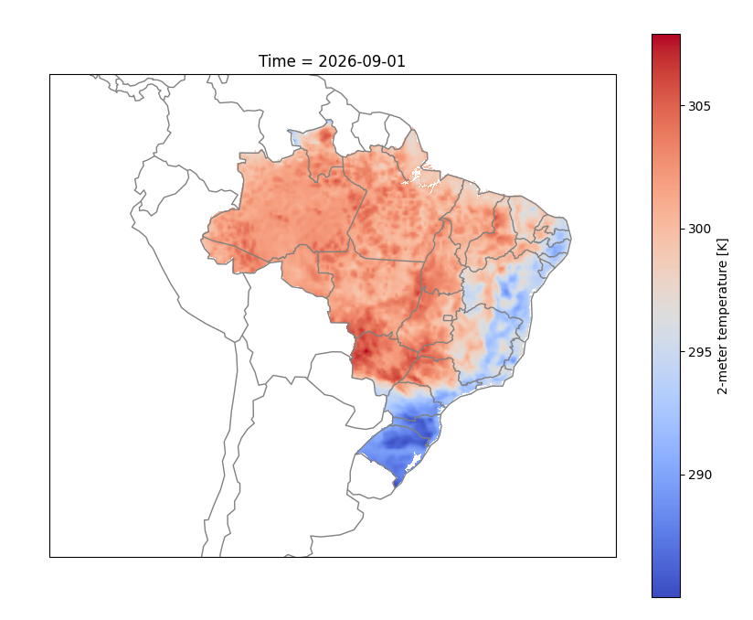

Exemplos Python
===============

.. warning::
   Alterar para os valores exibidos na inicialização.

   Inicialização comando:
   mon = MON.model()

  
.. note::
#### Model for Ocean-laNd-Atmosphere PredictioN - (MONAN) (10km) #####

Forecast data available for reading between 20260921 and 20261001.

Surface variables: ['u10m', 'v10m', 't2m', 'slp', 'psfc', 'landmask', 'sbcape', 'sbcin', 'pw', 'precip', 'rainnc', 'acswdnb', 'aclwupb', 'aclwupt', 'q2', 'hfx', 'lh', 'cldfrac_tot_UPP', 'terrain'].

Level variables:   ['t', 'u', 'v', 'rh', 'g', 'omega', 'spechum'].

levels (hPa): ['1000', '925', '850', '775', '700', '500', '400', '300', '250', '200', '150', '100', '70', '50', '30', '20', '10', '3'].

Frequency: every 3 hours  [0,3,6,...,264].

.. warning::
     ``date = '2026092800'`` - Trocar por data atual ou consultar datas no Dataserver do CPTEC.
  

Recuperar Dados do Modelos Numérico SubSazonal
----------------------------------------------
.. code-block:: console

  # Importar a biblioteca
  import monanmodel.CPTEC_MONAN as MON

  # Inicializar o construtor
  mon = MON.model()

  # Data Condição Inicial (IC)
  date = '2026092800'

  # Variáveis
  vars = ['t']

  # Níveis
  levels = [1000]

  # Steps = Número de simulações futuras a partir da inicialização do modelo
  steps = [0]

  # Utizando o método load
  f = mon.load(date=date, var=vars,level=levels, steps=steps)

  # Imprimir o Xarray
  print(f)
  

Recuperar Dados e Salvar em NetCDF
-------------------------------

.. warning:: 
   Foram implementados mecanismos para prevenir travamentos e garantir maior eficiência no processamento, evitando o uso excessivo de memória. O pedido corresponde a aproximadamente **3,19 GB** de dados; por isso, recomenda-se utilizar a função **`mon.save_by_day()`** para gravar em formato NetCDF, assegurando que a operação seja concluída de forma estável e otimizada.

.. code-block:: console

  # Importa a biblioteca
  import monanmodel.CPTEC_MONAN as MON

  # Inicializa o construtor
  mon = MON.model()

  # Data Condição Inicial (IC)
  date = '2026092800'

  # Variáveis
  vars = ['t']

  # Niveis
  levels = [1000,925,850]

  #Steps = Numero de simulações futuras a partir da inicialização do modelo
  steps = 120

  # Utizando o método load
  f = mon.load(date=date, var=vars,level=levels, steps=steps)

  # Salvar para NetCDF
  mon.save_by_day(f)

Recuperar Dados e Plotar Figura
-------------------------------

.. code-block:: console

   pip install cartopy

.. code-block:: console

  import monanmodel.CPTEC_MONAN as MON
  import matplotlib.pyplot as plt
  import cartopy.crs as ccrs
  import cartopy.feature as cfeature

  # Inicializa o construtor
  mon = MON.model()

  # Requisição dos dados
  f = mon.load_shape(date='20260901', var=['t2m'], shp='paises_bra')

  # Definir tamanho da figura
  fig = plt.figure(figsize=(10,8))

  # Setar figura unica
  ax = fig.add_subplot(111, projection=ccrs.PlateCarree())

  # Colocar  Linhas de Borda dos paises e linhas costeiras
  ax.add_feature(cfeature.COASTLINE,color='grey')
  ax.add_feature(cfeature.BORDERS,color='grey')

  # Definir Regiao do Brasil
  ax.set_extent([-90,-30,10,-41], ccrs.PlateCarree())

  # Setar estados do Brasil
  states = cfeature.NaturalEarthFeature(category='cultural',
                                         name='admin_1_states_provinces_lines',
                                         scale='50m', facecolor='none')
  # Colocar Estados Brasil
  ax.add_feature(states, edgecolor='gray')

  # Plotar variavel
  f.t2m.sel(Time="2026-09-01").plot(cmap="coolwarm")

  plt.show()

 

