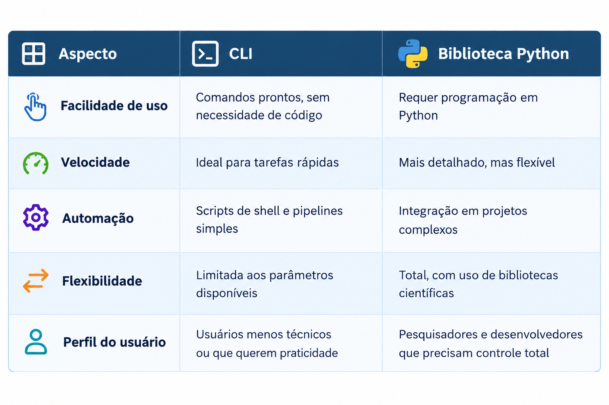

Como Usar
=========

Acesso aos dados MONAN
----------------------

Na nova versão dos pacotes de distribuição dos **Modelos Numéricos MONAN**, oferecemos duas formas de acessar, filtrar e receber os dados:

- `Interface de Linha de Comando (CLI) <usageCLI.html>`_ 
  A maneira mais recente e prática, permitindo interação direta com o sistema.

- `Biblioteca Python <usagePython.html>`_ 
  O método tradicional, que continua disponível para quem prefere integrar o MONAN em seus scripts e aplicações.

Comparativo: CLI vs Biblioteca Python
-------------------------------------

.. note::

Horários de inicialização do modelo MONAN
------------------------------------------

  date = 'YYYYMMDD' ou
  date = 'YYYYMMDDHH' - não informar HH usa o default **00 UTC**

  O modelo **MONAN** roda com dois horários de inicialização principais:

  - **00 UTC** → fornece previsões de até **11 dias**.  
  - **12 UTC** → fornece previsões de até **5 dias**.

  Dessa forma, o usuário pode escolher entre uma previsão mais longa (00 UTC) ou uma previsão mais curta e atualizada (12 UTC), conforme sua necessidade.

.. note::

Intervalo de previsão do MONAN
------------------------------

  O modelo **MONAN** gera saídas em intervalos regulares de tempo.  
  Cada **step** corresponde a uma previsão com avanço de **3 horas** em relação ao anterior.

  Isso significa que os dados disponíveis seguem a sequência: 0h, 3h, 6h, 9h, 12h, e assim por diante, até o limite definido pela inicialização (00 UTC ou 12 UTC).

  - **00 UTC** → fornece previsões de até **264 horas**.  
  - **12 UTC** → fornece previsões de até **120 horas**.

  Dessa forma, o número máximo de steps é:
  - **264** para o modelo inicializado às **00 UTC**.  
  - **120** para o modelo inicializado às **12 UTC**.

  steps = **<int>**
  
  Define o número de steps que serão pedidos
  
  Ex. steps = ``6`` 
  
  O pedido será os steps ``0,3,6``
  
  steps = **<list>**
  
  Define os steps que serão pedidos 

  O step do MONAN é de 3 em 3 horas
  Ex. steps =  ``[0,3,6]``
  O pedido será os steps específicos pedidos ``0,3,6,9``

